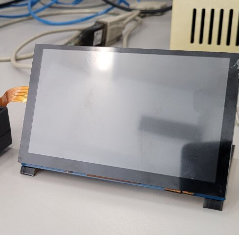

# Heads-Up Navigation System (Nav-HUD)

> A low-cost, in-vehicle heads-up navigation prototype that renders a live map and
> turn-by-turn guidance on a Raspberry Pi touchscreen — keeping the driver's eyes on the road.

**ECE 441 — Senior Design / Embedded Systems Project · Illinois Institute of Technology**

<!-- Add a photo of the physical build at assets/physical-build.jpg and it will show here -->
<!--  -->


---

## Overview

Nav-HUD is a self-contained navigation unit built on a **Raspberry Pi 4** with a touch LCD.
The user enters a destination address; the system geocodes it, computes the shortest
driving route across a pre-built road graph of Chicago, renders the route on a dark,
high-contrast map, and surfaces route info, ETA, and navigation instructions on screen.

The project explores how a **transparent OLED heads-up display** can keep navigation cues
in the driver's line of sight, reducing the time spent glancing away from the road. The
software in this repository drives the map generation, routing, and on-screen UI.

## Key features

- **Offline-capable road graph** — the entire Chicago drive network is downloaded once via
  OpenStreetMap and saved locally as a `.graphml` file, so routing does not depend on a
  live map API at run time.
- **Address-to-route planning** — destination addresses are geocoded with Nominatim, snapped
  to the nearest graph nodes, and connected to the origin via Dijkstra shortest path
  (weighted by real edge lengths).
- **Dynamic-zoom route rendering** — the map view automatically fits a bounding box around
  the computed route and highlights it in red over a dark basemap.
- **ETA estimation** — total route distance is summed from edge lengths and converted to an
  estimated travel time using an average-speed model.
- **Touch UI (Kivy)** — sized for a small in-dash LCD (600 × 380), with an address field,
  map view, route/ETA labels, and a Bluetooth connection control.
- **GPS-ready** — supports a live GPS fix via `gpsd` for the origin, with a fixed fallback
  origin (Willis Tower) for bench testing.

## How it works

```
+---------------------+     +----------------------+     +---------------------+
| Graph preprocessing |     |   Route planning     |     |   Rendering + UI    |
| (one-time, offline) | --> |                      | --> |                     |
| OSMnx graph_from_   |     | - Geocode address    |     | - Plot route (OSMnx |
| place("Chicago")    |     |   (Nominatim)        |     |   + Matplotlib)     |
| + add edge lengths  |     | - nearest_nodes()    |     | - Dynamic-zoom bbox |
| -> chicago_drive_   |     | - nx.shortest_path   |     | - ETA + nav labels  |
|    UPDATED.graphml   |     |   (weight=length)    |     | - Kivy touchscreen  |
+---------------------+     +----------------------+     +---------------------+
```

1. **`Graph_Data_Creation_Code.py`** builds the Chicago driving network with OSMnx,
   attaches edge-length attributes, and saves `chicago_drive_UPDATED.graphml`. This is run
   once; the app loads the saved graph at startup.
2. **`st_hud.py`** loads the graph, geocodes the destination, finds the nearest nodes to the
   origin and destination, and computes the shortest path with NetworkX.
3. The route is plotted with OSMnx/Matplotlib (Agg backend) onto a PNG that the Kivy `Image`
   widget displays, with the view zoomed to the route's bounding box.
4. ETA is computed from the summed edge lengths and shown alongside turn-by-turn text.

## Tech stack

| Layer | Tools |
|-------|-------|
| Language | Python 3 |
| Routing / geospatial | OSMnx, NetworkX, GeoPy (Nominatim) |
| Rendering | Matplotlib (Agg) |
| UI | Kivy (`.kv` layout) |
| Positioning | gpsd (live GPS), Bluetooth (planned media/metadata) |
| Hardware | Raspberry Pi 4, touch LCD, transparent OLED (HUD optics) |

## Repository structure

```
.
|- st_hud.py                      # Main Kivy app: routing, ETA, rendering, UI logic
|- st_hud.kv                      # Kivy UI layout (buttons, map image, labels)
|- Graph_Data_Creation_Code.py    # One-time script to build the Chicago road graph
|- chicago_drive_UPDATED.graphml  # Pre-built Chicago driving network with edge lengths
|- default_map.png                # Rendered basemap shown before a route is planned
\- README.md
```

## Getting started

### Prerequisites

- Python 3.9+
- A Raspberry Pi 4 (or any desktop for development/testing)

### Installation

```bash
git clone https://github.com/Hardovskyi/Nav-HUD-ECE441-Team-1.git
cd Nav-HUD-ECE441-Team-1

python -m venv venv
source venv/bin/activate          # Windows: venv\Scripts\activate

pip install osmnx networkx geopy matplotlib kivy
# Optional, for live GPS on the Pi:
pip install gpsd-py3
```

> **Note:** OSMnx pulls in geospatial dependencies (GeoPandas, Shapely, etc.). On a
> Raspberry Pi, installing these via `apt`/`conda` is often smoother than pip.

### Run the app

```bash
python st_hud.py
```

Enter a destination address (e.g. `233 S Wacker Dr, Chicago`) and press **Enter**. The map
updates with the highlighted route, ETA, and navigation text. By default the origin is set
to Willis Tower; set `use_gps = True` in `plan_route_to_address()` to use a live GPS fix.

### Rebuild the road graph (optional)

```bash
python Graph_Data_Creation_Code.py
```

This regenerates `chicago_drive_UPDATED.graphml` from current OpenStreetMap data.

## Project report

<!-- Add the full team report at docs/Nav-HUD-Report.pdf and link it here -->
<!-- [Full project report (PDF)](docs/Nav-HUD-Report.pdf) -->
The full design report (requirements, architecture, hardware design, and test results) is
available in the [`docs/`](docs/) folder.

## Roadmap / future work

- Spoken and richer turn-by-turn instructions (current implementation is a placeholder).
- Bluetooth media integration (now-playing metadata + playback controls) on the HUD.
- Rendering directly to the transparent OLED layer for true heads-up projection.
- On-device route caching and incremental re-routing.

## Team & acknowledgments

Built as a team project for **ECE 441 at Illinois Institute of Technology**. This repository
is maintained by [@Hardovskyi](https://github.com/Hardovskyi) (Daniil Skvyrskyi), who
contributed to map generation, route planning, dynamic-zoom rendering, and ETA. Thanks to
the full Team 1 for collaboration across hardware, software, and HUD optics.

---

*Maintained by Daniil Skvyrskyi · [LinkedIn](https://linkedin.com/in/daniil-skvyrskyi/)*
